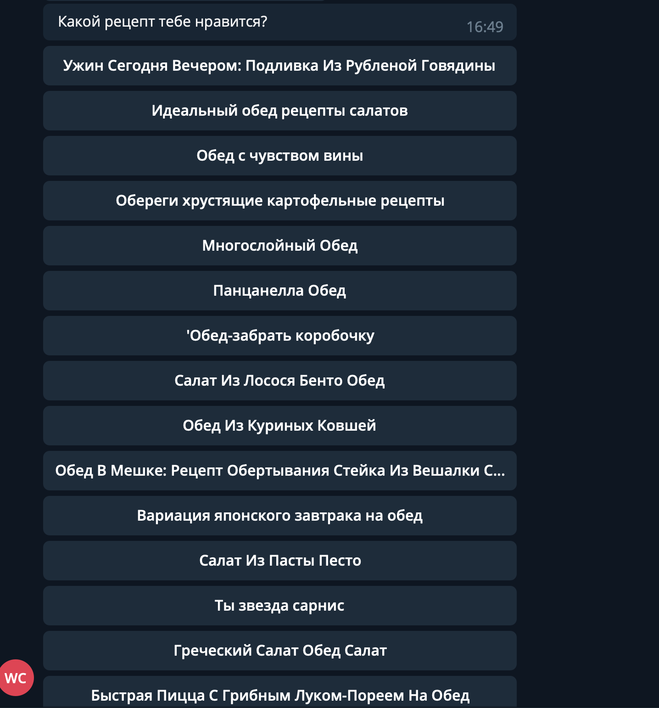
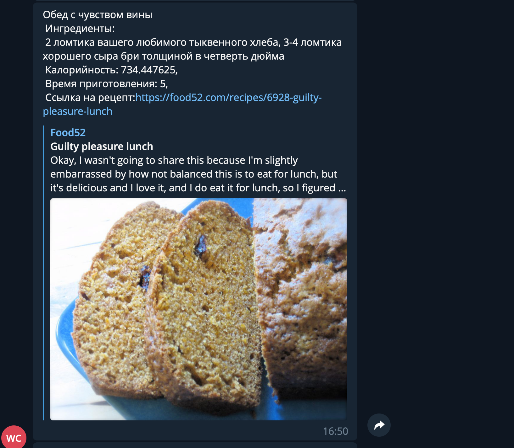

# Бот с рецептами
Простой телеграм-бот для выбора рецептов блюд различных типов (завтрак, обед, ужин и др.)
Выполнен с использованием telegram-bot-api, Yndex Translate Api, Edamam API - база рецептов на английском языке.

# Установка 
 
git clone 
npm i
node index

# Описание
Отвечая на вопросы бота можно получть рецепт на русском языке, переведенный при помощи Yandex.Translate. Результаты перевода порой бывают довольно забавными).

# Привет!

# После выбора типа блюд бот пришлет список блюд для просмотра

# После клика на понравившееся названия бот выдаст более подробное описание блюда

К сожалению, в этой БД не хранится полного описания приготовления блюда, но его можно посмотреть, перейдя по ссылке на рецепт.
Выполнен мной самостоятельно.

